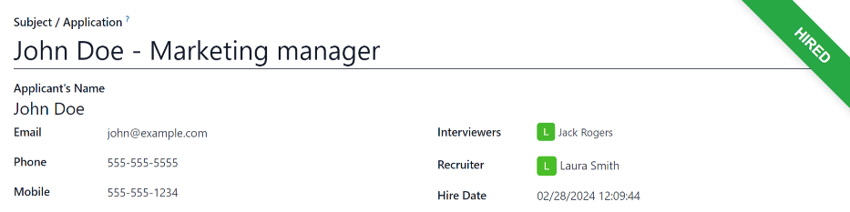

===================
Offer job positions
===================

Once an applicant has successfully passed the various interview stages, the recruitment team is
ready to send an offer for employment. The next step is to send the applicant a contract.

Contract proposal
=================

When an offer is ready to be sent, the corresponding applicant card can be moved to the
:guilabel:`Contract Proposal` stage. Drag and drop the applicant's card to the :guilabel:`Contract
Proposal` stage, or click the :guilabel:`Contract Proposal` stage button in the top-right of the
applicant's card.

The next step is to send an offer to the applicant. On the applicant's card, click the
:guilabel:`Generate Offer` button. A :guilabel:`Generate a Simulation Link` pop-up window appears.
Most fields are pre-populated with information from the job position. If any necessary fields are
blank, or if any information needs to be updated, enter or update the relevant information in the
corresponding fields.

.. note::
   Depending on the localization setting for the company, and which applications are installed, some
   fields may not appear in the :guilabel:`Generate a Simulation Link` pop-up window.

   For example, if the *Fleet* application is **not** installed, any fields related to vehicles do
   **not** appear.

Universal fields
----------------

The following fields appear for all offers sent to applicants, regardless of the localization.

- :guilabel:`Contract Template`: the template currently being used to populate the
  :guilabel:`Generate a Simulation Link` pop-up window. Use the drop-down menu to select a different
  :guilabel:`Contract Template`, if desired.

  To modify the template, hover over the current template name, and click the
  :icon:`oi-launch` :guilabel:`Internal link` icon that appears to the right of the drop-down arrow.
  Make any desired changes, then click :guilabel:`Save & Close`.
- :guilabel:`Job Position`: the name of the :guilabel:`Job Position` being offered to the applicant.
  The selections available in the drop-down menu correspond to the :guilabel:`Job Positions`
  configured on the main *Recruitment* dashboard.
- :guilabel:`Job Title`: the specific name of the position being offered to the applicant.
- :guilabel:`Department`: the :guilabel:`Department` the job position falls under.
- :guilabel:`Contract Start Date`: the date the contract takes effect. The default date is the
  current date. To modify the date, click on the displayed date to reveal a calendar pop-up window.
  Navigate to the desired month, then click the day to select the date.
- :guilabel:`Yearly Cost`: the annual salary being offered.
- :guilabel:`Link Expiration Date`: the number of days the job offer is valid. The default
  expiration date is `30` days. Modify the expiration date, if desired.

Send offer
----------

When the :guilabel:`Generate a Simulation Link` pop-up window information is correct, click
:guilabel:`Send By Email`, and an email pop-up window loads.

If the applicant does not have an email address listed on their applicant card, a warning appears in
a red box at the bottom of the :guilabel:`Generate a Simulation Link` pop-up window, stating:
:guilabel:`The applicant does not have a valid email set. The Offer Link won't be able to be
completed.` Click :guilabel:`Discard`, then enter an email on the applicant's card. Once an email is
entered, click the :guilabel:`Generate Offer` button, and the email pop-up window loads again.

The default :guilabel:`Recruitment: Your Salary Package` email template is used, and the
:guilabel:`Recipients`, :guilabel:`Subject`, and email body are pre-populated based on the email
template.

If any attachments need to be added, click the :icon:`fa-paperclip` :guilabel:`Attachments` button,
and a file explorer window appears. Navigate to the desired file, then click :guilabel:`Open` to
attach it to the email. The attachment loads, and is listed above the :icon:`fa-paperclip`
:guilabel:`Attachments` button.

Once the email is ready to send, click :guilabel:`Send`. The email pop-up window closes, and an
:guilabel:`Offers` smart button appears at the top of the applicant's card.

.. note::
   To send an offer, ensure the *Sign* application is installed. This is necessary so the offer can
   be sent to the applicant by the recruiter, and they can sign the offer. The applicant does
   **not** need any software installed to sign the offer.

.. image:: offer_job_positions/send-offer.png
   :align: center
   :alt: Send an email to the applicant with a link to the offered salary.

Configure your package
----------------------

The email template includes a :guilabel:`Configure your package` button. This link takes the
applicant to a webpage where they can modify the proposed salary package, and enter their personal
information.

Once the applicant is hired, the personal information entered on the webpage is imported into their
employee record, when created.

If applicable, the applicant can modify their salary package. This option is not available for all
localizations. Depending on where the company is located, this option may not be available.

Once all the information is completed, the applicant then accepts the offer by clicking the
:guilabel:`Review Contract & Sign` button to accept the contract and sign it using the *Sign*
application.

.. _recruitment/offer_job_positions/contract-signed:

Contract signed
===============

Once the applicant has accepted the offer and signed the contract, the next step is to move the
applicant to the :guilabel:`Contract Signed` stage. This stage is folded in the Kanban view, by
default.

To move the applicant to that stage, drag and drop the applicant's card to the :guilabel:`Contract
Signed` stage, or click the :guilabel:`...` button to the right of :guilabel:`Contract Proposal` on
the applicant's card, then click :guilabel:`Contract Signed`.

Once the applicant's card moves to the :guilabel:`Contract Signed` stage, a green :guilabel:`HIRED`
banner appears in the top-right of the applicant's card.

Create employee
===============

Once the applicant has been hired, the next step is to create their employee record. Click the
:guilabel:`Create Employee` button in the top-left corner of the applicant's card.

An employee form appears, with information from the applicant's card, and the employee contract,
are imported into the employee card.

Fill out the rest of the employee form. For detailed information on the fields, refer to the
:doc:`../employees/new_employee` documentation.

When done, the employee record is saved in the *Employees* app.
