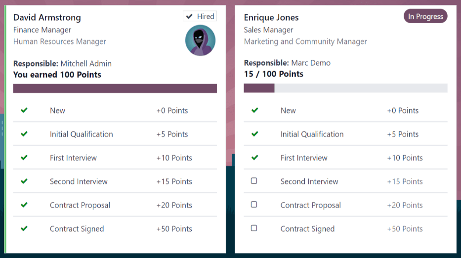

===============
Referral points
===============

The *Referrals* application allows employees to earn points that are then exchanged for
:doc:`rewards <rewards>`.

Current referral points can be viewed on the main *Referrals* app dashboard, which appears when the
application is opened. At the top, a summary of the user's current points is displayed. The left
side of the summary displays the total points earned, and the right side displays the points that
are available to spend.

To view the various referral stages and their respective earned points, click one of the buttons
directly beneath the avatars. The options are :guilabel:`Referrals`, :guilabel:`Ongoing`, and
:guilabel:`Successful`.

The current number of referrals that are still active in the recruitment pipeline, but have not yet
been hired or refused, appear above the :guilabel:`Ongoing` button. The number of referrals that
have been hired appears above the :guilabel:`Successful` button. The total number of referrals, both
the ongoing and successful referrals combined, appears above the :guilabel:`Referrals` button.

.. note::
   To view the referrals associated with each of the categories, :guilabel:`Referrals`,
   :guilabel:`Ongoing`, and :guilabel:`Successful`, click on the corresponding button. All the
   referrals for that specific category are displayed.

My referrals
============

To see all the referrals, both ongoing and successful, click the :guilabel:`Referrals` button. The
:guilabel:`My Referral` screen loads, and displays all the referrals, with each individual referral
housed in its own referral card.

A successful referral displays a white :icon:`fa-check` :guilabel:`Hired` badge in the top-right
corner of the card, along with a vertical green stripe along the left-side of the card. Referrals
that are in process display a purple :guilabel:`In Progress` badge in the top-right corner.

Each referral card lists the name of the applicant, the subject/application title as it appears on
the applicant card in the *Recruitment* app, the name of the job position, the person responsible
for filling the role (the recruiter), and the points earned.

For referrals that have been hired, the selected avatar also appears on the card.

Points
------

The points that can be earned for a referral are the same across all job positions. Each stage of
the recruitment process has corresponding points assigned to it. The stages listed correspond to the
stages configured in the *Recruitment* application.

On each individual referral card, beneath the points earned is a bar chart that displays how many
points have been earned out of the total possible points that can be earned if the applicant is
hired.

Beneath the bar chart is a list of the various recruitment stages and the points earned when the
referral moves to that stage. If a stage has been achieved and the points have been earned, a green
:icon:`fa-check` :guilabel:`(checkmark)` appears next to the stage.

.. note::
   The preconfigured point structure for referrals is as follows:

   - :guilabel:`Initial Qualification`: 1 point
   - :guilabel:`First Interview`: 20 points
   - :guilabel:`Second Interview`: 9 points
   - :guilabel:`Contract Proposal`: 5 points
   - :guilabel:`Contract Signed`: 50 points

   The default total points earned for a referral that is hired is 85 points. Modifications of the
   points earned for each stage are made in the *Recruitment* application. Refer to the
   :ref:`Recruitment <recruitment/modify-stages>` documentation to modify the points for each stage.
