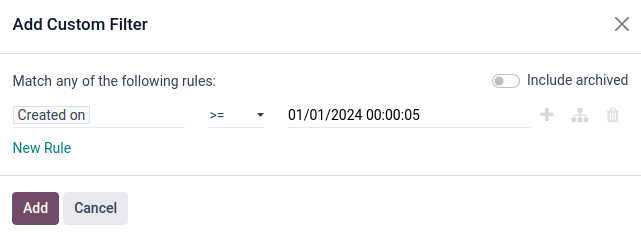
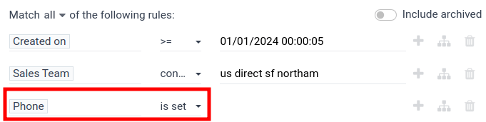

========================
Lead distribution report
========================

A *lead distribution report* can be used to see if active leads are being assigned equitably
across sales members, view the distribution of good or `quality leads <https://www.odoo.com/
documentation/17.0/applications/sales/crm/track_leads/quality_leads_report.html>`_, and see how
frequently each salesperson is receiving and keeping leads.

Lead distribution reports can be run each week to help keep each salesperson on track while
providing them with ample good leads. These reports can also be used to see whether sales members
are staying productive, if good leads are being lost too often by one salesperson, and see what
percentage of good leads are being retained overall.

Create a lead distribution report
=================================

To create a lead distribution report, first navigate to :menuselection:`CRM app --> Reporting -->
Pipeline` to open the :guilabel:`Pipeline Analysis` dashboard. Click into the :guilabel:`Search...`
bar at the top of the page, and remove the default filters. All leads will now be displayed in the
list.

Custom filters can now be added by clicking the :icon:`fa-caret-down` :guilabel:`drop-down menu`
button to open the search options. Three columns will be displayed: :guilabel:`Filters`,
:guilabel:`Group By`, and :guilabel:`Favorites`.

.. image:: lead_distribution_report/filters-dropdown.png
   :align: center
   :alt: Clicking the dropdown arrow in the search bar will display filters, groups, and favorites.

To begin, navigate to the bottom of the :guilabel:`Filters` column and click :guilabel:`Add Custom
Filter`. This will open a new pop-up window where a custom filter can be created.

.. image:: lead_distribution_report/add-custom-filters.png
   :align: center
   :alt: The Add Custom Filter pop-up window allows custom filtering rules to be created.

Create a custom filter
----------------------

The following conditions are provided as an example of a good but not comprehensive set of rules for
finding good leads:

#. Lead creation date
#. Sales team location
#. Contains a phone number
#. An active state is set
#. Referred by appointment
#. Source is livechat
#. Notes are set
#. Tagged with a size from 10-20 or 20-50
#. Email does not contain bad addresses
#. An active salesperson is set

Any number of conditions can be added, removed, or modified to best fit the desired information in
the report.

Add lead creation date
~~~~~~~~~~~~~~~~~~~~~~

Click the first field on the left under :guilabel:`Match any of the following rules:` with the value
:guilabel:`Country` in it. Type :guilabel:`Date` in the :guilabel:`Search...` bar, or scroll to
search through the list to locate it. Then, click the next field and select :guilabel:`>=` from the
drop-down menu. This operator will include only values greater than or equal to the value in the
rightmost field.

The rightmost field should contain the earliest date leads are selected from. For example,
setting `01/01/2024 00:00:05` will include only leads created from, and including, the first day of
2024.

Add sales team location
~~~~~~~~~~~~~~~~~~~~~~~

Click :guilabel:`New rule` to add a new rule and another horizontal set of fields will appear. Click
the first field for the new rule, and set it to :guilabel:`Sales Team`. Then, click the next
field and select :guilabel:`contains` from the drop-down menu. Selecting this operator will filter
for any records that contain the words in the rightmost field.

In this third field, enter the name of the desired sales teams. For example, setting `us direct sf
northam` will include only sales teams assigned to the U.S., direct, San Francisco, and North
America.

.. image:: lead_distribution_report/sales-team-location.png
   :align: center
   :alt: Use Sales Team to filter the location the lead is associated with.

Add phone number
~~~~~~~~~~~~~~~~

Click :guilabel:`New rule` to add a new rule to the filter. Set the first field to
:guilabel:`Phone`. Then, click the next field and select :guilabel:`is set` from the drop-down menu.
Selecting this operator will filter only for records that have a phone number associated with the
lead.

Add active status
~~~~~~~~~~~~~~~~~

Click the :guilabel:`Branch` icon to the right of :guilabel:`Phone is set` to add a new rule that
branches from the rules above.

Two horizontal sets of fields will appear below a line showing
:guilabel:`all of:` with a :icon:`fa-caret-down` down arrow. Click the down arrow, then select
:guilabel:`any` from the list.

Set the first field to :guilabel:`Active`. Then, click the rightmost field and select
:guilabel:`is set` from the drop-down menu.

.. image:: lead_distribution_report/add-branch.png
   :align: center
   :alt: Click the second button to the right of phone is set labeled add branch.

Next, click the :icon:`fa-plus` :guilabel:`New Rule` button next to :guilabel:`Active is set` to
create a new set of fields. Set the first field to :guilabel:`Active`. Then, click the next field
and select :guilabel:`is not set` from the drop-down menu. This rule will add the activity status of
the lead to the report.

.. image:: lead_distribution_report/active-set.png
   :align: center
   :alt: Use Active to include active status in the report.

Add referred by
~~~~~~~~~~~~~~~

Click the :guilabel:`Branch` icon to the right of :guilabel:`any of:` field to add a new set of
rules that branches from the rules above and another horizontal set of fields will appear below.
Change :guilabel:`all of:` to :guilabel:`any of:`.

Next, set the first field to :guilabel:`Referred By`. In the field to the right, select
:guilabel:`contains` from the drop-down menu. In the last field, type `appointment`. This will add
any leads that were referred by an appointment.

.. image:: lead_distribution_report/referred-by.png
   :align: center
   :alt: Add referred by as a branch to filter appointments.

Add source
~~~~~~~~~~

Click the :icon:`fa-plus` :guilabel:`New Rule` button next to :guilabel:`Referred by appointment`.
Set the first field to :guilabel:`Source`. Click the next field and select :guilabel:`contains` from
the drop-down menu. Select the next field to the right and type `livechat`. This rule will add any
leads that came from livechat to the report.

.. image:: lead_distribution_report/add-source.png
   :align: center
   :alt: Adding a rule for source to filter for livechat.

Add notes
~~~~~~~~~

Click the :icon:`fa-plus` :guilabel:`New Rule` button next to :guilabel:`Source contains livechat`.
Set the first field to `Notes`. Click the next field and select :guilabel:`contains` from the
drop-down menu. Select the next field to the right and type `mrp`. Click the :icon:`fa-plus`
:guilabel:`New Rule` icon next to :guilabel:`Notes contains mrp` and add a new rule for Notes
containing `stock`. Repeat the process to create new rules containing the following terms:

#. purchase
#. plm
#. crm
#. sales
#. project
#. fsm

.. image:: lead_distribution_report/add-notes.png
   :align: center
   :alt: Add rules that contain the 8 terms listed above.

This will include any leads with the above terms in the attached notes to the report.

Add tags
~~~~~~~~

Click the :icon:`fa-plus` :guilabel:`New Rule` icon next to :guilabel:`Notes contains fsm`.
Set the first field to `Tags`. Click the next field and select :guilabel:`contains` from the
drop-down menu. Select the next field to the right and type `20`. This will add any leads that are
tagged as a size of 5-20 or 20-50.

.. image:: lead_distribution_report/add-tags.png
   :align: center
   :alt: Add a rule for "20" to filter size.

Add email
~~~~~~~~~

Click :guilabel:`New rule` to add a new rule outside the :guilabel:`any of:` group. Set the first
field to :guilabel:`Email`. In the next field to the right, select :guilabel:`does not contain` from
the drop-down menu. Next, type `hotmail` into the rightmost field.

Repeat the previous steps to add rules for the following contents:

#. aol.com
#. icloud.com
#. yahoo

.. image:: lead_distribution_report/add-email.png
   :align: center
   :alt: Add rules to filter out the above four email domains.

Add salesperson
~~~~~~~~~~~~~~~

Click :guilabel:`New rule` to add a new rule. Click the first field and locate
:guilabel:`salesperson`. Click the :icon:`fa-chevron-right` chevron button to the right. A new list
of attributes relating to salespeople will appear. Select :guilabel:`Active` from the list. In the
next field to the right, select :guilabel:`is` from the drop-down menu. In the right-most drop-down
menu, select :guilabel:`set`.

.. image:: lead_distribution_report/add-salesperson.png
   :align: center
   :alt: Add a salesperson's activity status to ensure an active salesperson is selected.